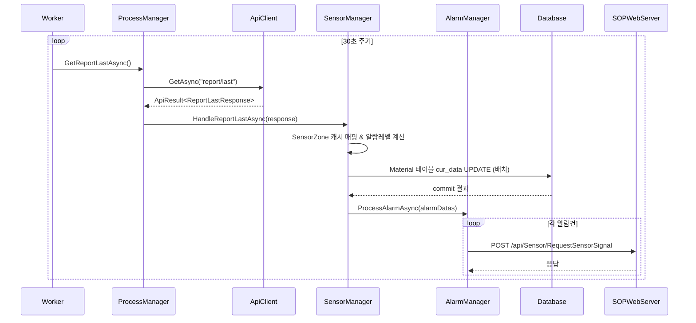
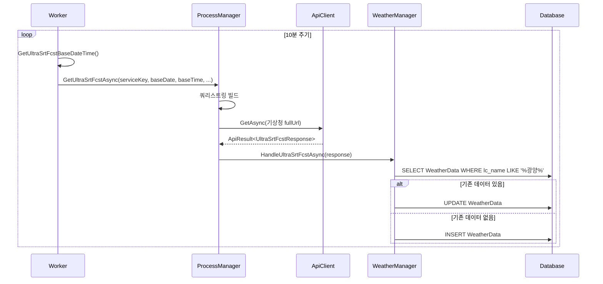
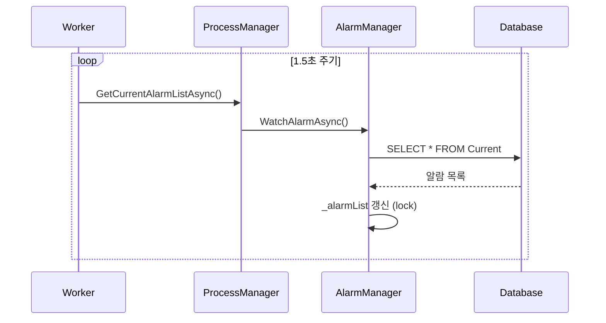
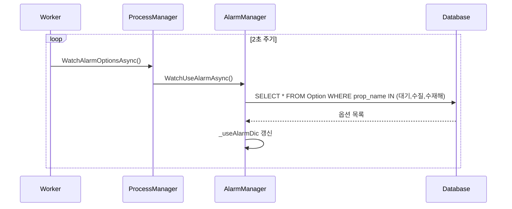
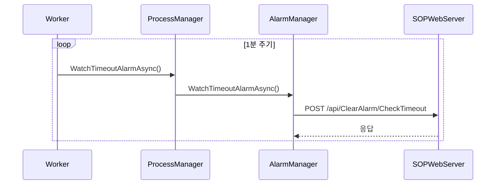
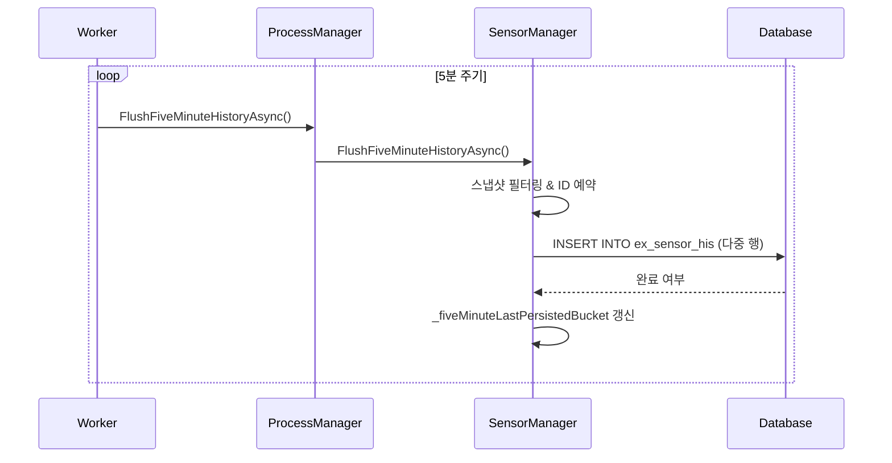
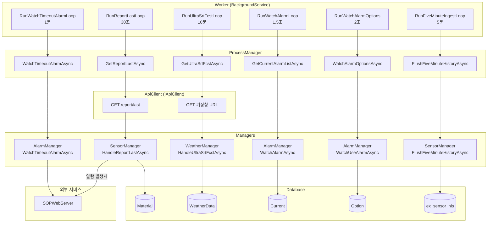

# GwangyangSensorService appsettings.json 요약

대상 파일: `appsettings.json`

## Logging
- `Logging:LogLevel:Default` 기본 로그 레벨
- `Logging:LogLevel:Microsoft.Hosting.Lifetime` 호스팅 수명주기 로그 레벨

## Log
- `Log:LogFolder` 로그 저장 경로
- `Log:LogLifeTime` 로그 보관 기간(일)
- `Log:LogFileTag` 로그 파일 태그
- `Log:UseChannelFolders` 루프/서비스 채널별 하위 폴더 분리 사용 여부
- `Log:ArchiveAfterDays` 닫힌 월의 txt 로그를 zip archive 후보로 보기 시작하는 기준 일수
- `Log:DeleteArchiveAfterDays` 오래된 zip archive 자동 삭제 기준 일수
- `Log:MaxArchiveSizeGB` archive 전체 용량 상한(초과 시 채널별 가장 오래된 zip부터 순환 삭제)
- `Log:MaxActiveFileSizeMB` 활성 txt 로그 파일 최대 크기(MB). 초과 시 같은 날짜 내 `_001`, `_002` 식으로 분할
- `Log:DuplicateSuppressionMinutes` 글자 단위로 동일한 로그의 반복 억제 창(분, 기본 60). 0 이하면 억제하지 않음
  - 자세한 동작은 [Logging/README.md](Logging/README.md#동일-메시지-반복-억제-logdeduplicator) 참조
- `Log:DuplicateSuppressionMaxKeys` 억제 대상으로 추적할 서로 다른 메시지 개수 상한(기본 2000)

## Monitoring
루프 실패 추적기(`LoopFailureTracker`) 동작을 제어한다. 섹션이 없으면 기본값이 적용된다.
자세한 동작은 [Logging/README.md](Logging/README.md#루프-실패-추적-loopfailuretracker) 참조.

- `Monitoring:EscalateAfterConsecutiveFailures` 연속 실패가 이 횟수에 도달하면 `Error`로 승격(기본 3)
  - `Error`는 Windows Event Log로도 전달되므로 외부 감시 진입점이 된다
- `Monitoring:FailureRepeatIntervalMinutes` 장애 지속 중 요약 로그 주기(분, 기본 60)
- `Monitoring:SlowResponseWarningMs` API 응답이 이 시간(ms)을 넘으면 느린 응답으로 기록(기본 5000, 0 이하면 비활성)

## Site
- `Site:DBName` DB 이름
- `Site:DBType` DB 타입 식별자
- `Site:DbHost` DB 호스트
- `Site:DbID` DB 계정
- `Site:DbPw` DB 비밀번호

## Event
- `Site:SOPWebServerURL` SOP Web Server URL
  - Format: `http://example.com` **`주의`** : URL 마지막에 "/"를 포함하지 않음.

## API
- `API:BaseUrl` API 기본 주소
- `API:BearerToken` API 인증 토큰

## 공공데이터 포털 기상청 초단기예보 - 동봉된 지역코드 중 광양 지역 기반
- `WeatherAPI:ServiceKey` 공공데이터포털 서비스 키
- `WeatherAPI:Expiration` 키 만료일
- `WeatherAPI:BaseUrl` 기상청 초단기예보 API 주소
- `WeatherAPI:Nx` 예보 X 좌표
- `WeatherAPI:Ny` 예보 Y 좌표
- `WeatherAPI:NumOfRows` 조회 건수
- `WeatherAPI:PageNo` 페이지 번호
- `WeatherAPI:DataType` 응답 타입

---

## 타이머(주기 동작) 전체 플로우 분석

### 개요

`Worker.cs`의 `ExecuteAsync`에서 6개의 독립 루프가 `Task.WhenAll`로 동시 실행된다. 각 루프는 while문 안에서 주기적으로 작업을 수행하고, `Task.Delay`로 대기한다. (2026-03 기준) 신규 루프인 `RunFiveMinuteIngestLoop`는 센서 스냅샷을 5분 버킷으로 묶어 `ex_sensor_his` 테이블에 적재한다.

---

### 1. 각 타이머(루프)별 플로우

#### 1-1. RunReportLastLoop (센서 수치 수집)

| 항목 | 내용 |
|---|---|
| **루프명** | `RunReportLastLoop` |
| **주기** | 30초 (`TimeSpan.FromSeconds(30)`) |
| **ApiClient 메서드** | `GetAsync<ReportLastResponse>("report/last")` |
| **Manager** | `SensorManager.HandleReportLastAsync()` |
| **DB 저장** | `Material` 테이블 `cur_data` 컬럼 일괄 UPDATE (배치 트랜잭션) |
| **후속 처리** | 임계값 초과 시 `AlarmManager.ProcessAlarmAsync()` → `HttpClient.PostAsync("/api/Sensor/RequestSensorSignal")` (SOPWebServer) |

**호출 체인:**
```
Worker.RunReportLastLoop
  → ProcessManager.GetReportLastAsync
    → ApiClient.GetAsync<ReportLastResponse>("report/last")       ← 외부 API 호출
    → SensorManager.HandleReportLastAsync(response)
      → SensorZone 캐시 매핑 & Material 테이블 UPDATE (배치)     ← DB 저장
      → AlarmManager.ProcessAlarmAsync(alarmDatas)
        → AlarmManager.SendAlarmAsync (각 알람)
          → HttpClient.PostAsync("/api/Sensor/RequestSensorSignal") ← SOPWebServer 호출
```



---

#### 1-2. RunUltraSrtFcstLoop (기상 초단기예보)

| 항목 | 내용 |
|---|---|
| **루프명** | `RunUltraSrtFcstLoop` |
| **주기** | 10분 (`TimeSpan.FromMinutes(10)`) |
| **ApiClient 메서드** | `GetAsync<UltraSrtFcstResponse>(fullUrl)` (기상청 공공API 전체 URL) |
| **Manager** | `WeatherManager.HandleUltraSrtFcstAsync()` |
| **DB 저장** | `WeatherData` 테이블 INSERT 또는 UPDATE (단건) |

**호출 체인:**
```
Worker.RunUltraSrtFcstLoop
  → GetUltraSrtFcstBaseDateTime()                                ← 기준시각 계산
  → ProcessManager.GetUltraSrtFcstAsync(params...)
    → ApiClient.GetAsync<UltraSrtFcstResponse>(fullUrl)          ← 기상청 API 호출
    → WeatherManager.HandleUltraSrtFcstAsync(response)
      → WeatherData SELECT (기존 데이터 확인)                     ← DB 조회
      → WeatherData UPDATE 또는 INSERT                           ← DB 저장
```



---

#### 1-3. RunWatchAlarmLoop (현재 알람 목록 동기화)

| 항목 | 내용 |
|---|---|
| **루프명** | `RunWatchAlarmLoop` |
| **주기** | 1.5초 (`TimeSpan.FromMilliseconds(1500)`) |
| **ApiClient 사용** | 사용하지 않음 (DB 직접 조회) |
| **Manager** | `AlarmManager.WatchAlarmAsync()` |
| **DB 조회** | `Current` 테이블 전체 SELECT → 메모리 `_alarmList` 갱신 |

**호출 체인:**
```
Worker.RunWatchAlarmLoop
  → ProcessManager.GetCurrentAlarmListAsync()
    → AlarmManager.WatchAlarmAsync()
      → DataManager.GetSelect().Select<Current>(null)            ← DB 조회
      → _alarmList 메모리 캐시 갱신 (lock)
```



---

#### 1-4. RunWatchAlarmOptions (알람 사용 옵션 동기화)

| 항목 | 내용 |
|---|---|
| **루프명** | `RunWatchAlarmOptions` |
| **주기** | 2초 (`TimeSpan.FromSeconds(2)`) |
| **ApiClient 사용** | 사용하지 않음 (DB 직접 조회) |
| **Manager** | `AlarmManager.WatchUseAlarmAsync()` |
| **DB 조회** | `Option` 테이블 SELECT (대기/수질/수재해 알람 사용여부) → `_useAlarmDic` 갱신 |

**호출 체인:**
```
Worker.RunWatchAlarmOptions
  → ProcessManager.WatchAlarmOptionsAsync()
    → AlarmManager.WatchUseAlarmAsync()
      → DataManager.GetSelect().Select<Option>(조건)             ← DB 조회
      → _useAlarmDic 딕셔너리 갱신
```



---

#### 1-5. RunWatchTimeoutAlarmLoop (타임아웃 알람 체크)

| 항목 | 내용 |
|---|---|
| **루프명** | `RunWatchTimeoutAlarmLoop` |
| **주기** | 1분 (`TimeSpan.FromMinutes(1)`) |
| **ApiClient 사용** | 사용하지 않음 (HttpClient 직접 사용) |
| **Manager** | `AlarmManager.WatchTimeoutAlarmAsync()` |
| **외부 호출** | `HttpClient.PostAsync("/api/ClearAlarm/CheckTimeout")` → SOPWebServer |

**호출 체인:**
```
Worker.RunWatchTimeoutAlarmLoop
  → ProcessManager.WatchTimeoutAlarmAsync()
    → AlarmManager.WatchTimeoutAlarmAsync()
      → HttpClient.PostAsync("/api/ClearAlarm/CheckTimeout")     ← SOPWebServer 호출
```



---

#### 1-6. RunFiveMinuteIngestLoop (5분 이력 적재)

| 항목 | 내용 |
|---|---|
| **루프명** | `RunFiveMinuteIngestLoop` |
| **주기** | 5분 (`TimeSpan.FromMinutes(5)`) |
| **ApiClient 사용** | 사용하지 않음 (SensorManager 내부 스냅샷 활용) |
| **Manager** | `SensorManager.FlushFiveMinuteHistoryAsync()` |
| **DB 저장** | `ex_sensor_his` 테이블 INSERT (`sensor_his_no`, `sensor_sn`, `sensor_value`, `sensor_value_num`, `his_timestamp`, `temp_idx`) |

**호출 체인:**
```
Worker.RunFiveMinuteIngestLoop
  → ProcessManager.FlushFiveMinuteHistoryAsync
    → SensorManager.FlushFiveMinuteHistoryAsync
      → TrackFiveMinuteSnapshot(...) 으로 누적된 메모리 스냅샷 필터링
      → ReserveSensorHistoryIdsAsync(...) ← PK 선점
      → ex_sensor_his INSERT 배치 실행
      → _fiveMinuteLastPersistedBucket 갱신 & FileLogger 로그 남김
```

- `TrackFiveMinuteSnapshot`는 `RunReportLastLoop` 중에 호출되어 대기(Atmosphere) 및 기상(센서 타입 코드 300321) 센서만 추려 저장한다.
- 스냅샷 유효시간은 10분이며, 이미 동일 버킷(5분 단위)으로 적재된 센서는 `_fiveMinuteLastPersistedBucket` 검사로 제외한다.
- INSERT 성공 시 샘플 센서 ID와 적재 건수를 FileLogger로 남겨 가시성을 확보한다. 실패 시에는 오류 로그만 남기고 재시도는 다음 주기에 맡긴다.



---
### 2. ApiClient 메서드 목록

`ApiClient`는 `IApiClient` 인터페이스를 구현하며, 내부적으로 `SendAsync`를 통해 HTTP 요청을 처리한다.

| 메서드 | HTTP Method | 실제 사용처 | 엔드포인트 |
|---|---|---|---|
| `GetAsync<ReportLastResponse>` | GET | `ProcessManager.GetReportLastAsync` | `{BaseUrl}/report/last` |
| `GetAsync<UltraSrtFcstResponse>` | GET | `ProcessManager.GetUltraSrtFcstAsync` | 기상청 공공API 전체 URL (외부) |
| `GetAsync<SensorListResponse>` | GET | `ProcessManager.GetSensorListAsync` | `{BaseUrl}/sensor/list` |
| `GetAsync<NodeCategoryResponse>` | GET | `ProcessManager.GetNodeCategoryListAsync` | `{BaseUrl}/node/cate/list` |

> **참고**: `sensor/list`와 `node/cate/list`는 `ProcessManager`에 메서드가 정의되어 있지만, 현재 `Worker.cs`의 타이머 루프에서는 호출되지 않는다.

#### ApiClient 외 직접 HttpClient 사용

`AlarmManager`는 `IHttpClientFactory`로 생성한 별도 `HttpClient`를 통해 SOPWebServer API를 직접 호출한다.

| 호출처 | HTTP Method | 엔드포인트 | 용도 |
|---|---|---|---|
| `AlarmManager.SendAlarmAsync` | POST | `/api/Sensor/RequestSensorSignal` | 알람 발생 통보 |
| `AlarmManager.WatchTimeoutAlarmAsync` | POST | `/api/ClearAlarm/CheckTimeout` | 타임아웃 알람 점검 |

---

### 3. 데이터 저장 흐름 요약표

| 루프 | 주기 | 데이터 소스 | ApiClient 사용 | Manager | DB 테이블 | DB 동작 | 후속 처리 |
|---|---|---|---|---|---|---|---|
| `RunReportLastLoop` | 30초 | 외부 센서 API (`report/last`) | O (`GetAsync`) | `SensorManager` | `Material` | UPDATE (`cur_data`) | 임계값 초과 시 SOPWebServer 알람 전송 |
| `RunUltraSrtFcstLoop` | 10분 | 기상청 초단기예보 API | O (`GetAsync`) | `WeatherManager` | `WeatherData` | INSERT / UPDATE | - |
| `RunWatchAlarmLoop` | 1.5초 | DB 직접 조회 | X | `AlarmManager` | `Current` | SELECT (읽기) | 메모리 캐시 `_alarmList` 갱신 |
| `RunWatchAlarmOptions` | 2초 | DB 직접 조회 | X | `AlarmManager` | `Option` | SELECT (읽기) | 메모리 딕셔너리 `_useAlarmDic` 갱신 |
| `RunWatchTimeoutAlarmLoop` | 1분 | SOPWebServer 직접 호출 | X | `AlarmManager` | - (없음) | - | SOPWebServer 타임아웃 체크 위임 |
| `RunFiveMinuteIngestLoop` | 5분 | SensorManager 메모리 스냅샷 (대기·기상 타입) | X | `SensorManager` | `ex_sensor_his` | INSERT (5분 버킷) | `_fiveMinuteLastPersistedBucket` 갱신 & FileLogger 요약 |

> 위 루프의 실패는 모두 `LoopFailureTracker`를 거친다. 동일 실패가 반복돼도 로그가 도배되지 않으며,
> 연속 실패가 임계치를 넘으면 `Error`로 승격되어 Windows Event Log까지 전달된다.
> 설정과 동작은 [Logging/README.md](Logging/README.md#루프-실패-추적-loopfailuretracker) 참조.

---

### 4. 전체 아키텍처 플로우차트


